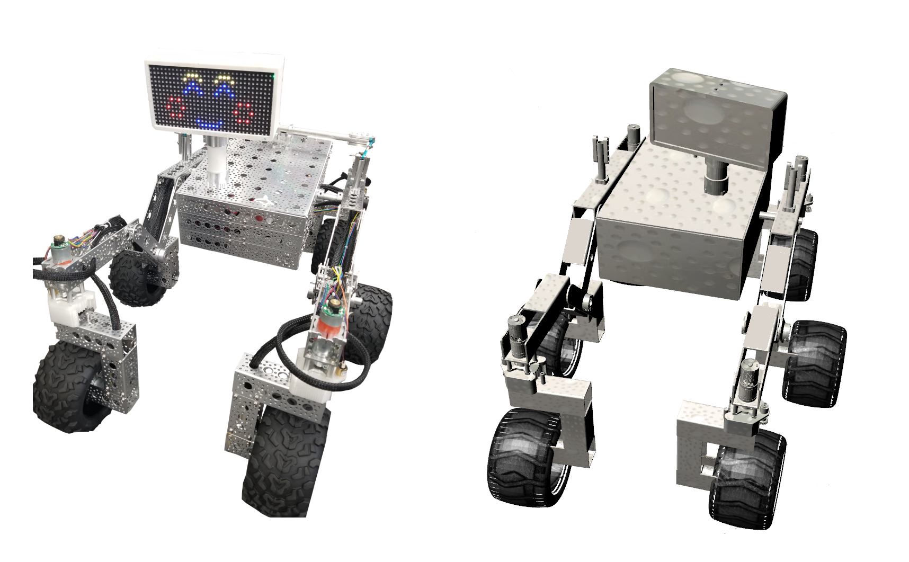
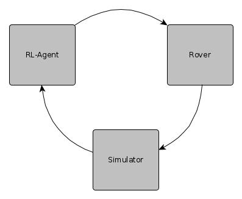

## Welcome to the AWS-JPL Open Source Rover Challenge repository.

Here you will find everything you need to begin the challenge.

The main sections of this document are:

1. [What is the challenge?](#whatis)

2. [What are the rules to the challenge](#whataretherules)

3. [Getting Started](#gettingstarted)

3. [Asset manifest and descriptions](#assetmanifest)

4. [Help and support](#help)

## <a name="whatis"> What is the Challenge?<a/>

 “AWS - JPL Open-Source Rover Challenge” to be held online starting on Monday, December 2, 2019 and ending on Friday, February 21, 2020 and is sponsored by Amazon Web Services, Inc. (“The Sponsor” or “AWS”) and is held in collaboration with JPL and AngelHack LLC (“Administrator”).

## <a name="whataretherules"> What are the rules?</a>

 Simply put - you must train an RL agent to successfully navigate the Rover to the checkpoint on Mars.

 the below images shows the NASA-JPL Open Source Rover (on the left) and your digital version of the Rover (on the right)

 To win the challenge, your RL agent must navigate the Rover to the checkpoint WITH THE HIGHEST SCORE

 The scoring function works such that when the Rover reaches the checkpoint without collisions, the mission is complete

    + Begin with 10,000 basis points
    + Subtract the number of steps required to reach the checkpoint
    + Subtract the distance travelled to reach the checkpoint (in meters)
    + Subtract the average linear acceleration in m/s^2 of the Rover

## <a name="gettingstarted">Getting Started</a>

 While familiarity with RoS and Gazebo are not required for this challenge, you will be required to submit your entry in the form of
an AWS Robomaker simulation job.  This repo can be cloned directly into a (Cloud9) Robomaker development environment. It will not do a very good job training, 
however as the reward_function (more on that below) is empty.

All of the Martian world environment variables, and Rover Sensor data are captured for you and are then 
made available via global Python variables.  At a minimum, you must populate the function known as the "reward_function()".  
The challenge ships with several examples of how to populate the reward function, but no level of accuracy or performance is guaranteed.

 If you wish to learn more about how the Rover interacts with it's environment, you can look at the "Training Grounds" world that also
ships with this repo.  It is a very basic world with monolith-type structures that the Rover must learn to navigate around.  You are free
to edit his world to learn more about how the Rover manuevers.  Submissions to the challenge must be done via an unedited Rover and an 
unedited Martian world.

## <a name="assetmanifest">Asset manifest and descriptions</a>

Project Structure:
	There are three primary components of the solution:
	
	    
	    + A RoS package describing the Open Source Rover - this package is NOT editable
	    + A RoS/Gazebo package that describes and runs the simulated world
	    + A Python3 module that contains a custom OpenAI Gym environment as well as wrapper code to initiate an rl_coach training session.  
	    within this module is a dedicated function 
	
	
    These three components work together to allow the Rover to navigate the Martian surface and send observation <-> reward tuples
	back to the RL-agent which then uses a TensorFlow algorithm to learn how to optimize actions.
	
	
Custom Gym Environment:
    This is gym environment exists as a single python file in src -> rl-agent -> environments -> mars_env.py
    
   mars_env.py is where you will create your reward function.  There is already a class method for you called:
    def reward_function(self)
    
   while you are free to add your own code to this method, you cannot change the signature of the method, or change the return types.
    
   the method must return a boolean value indicating if the episode has ended (see more about episode ending events below) 
   the method must also return a reward value for that time step.
    
   If you believe they are warranted, you are free to add additional global variables in the environment.  However, keep in mind
   if they are episodic values (values that should be reset after each episode) you will need to reset those values within the 
   reward_function method once you have determined the episode should end.
 
	
Recommended Episode ending scenarios:
    There are two scenarios that should automatically end an episode.
	1. If the Rover collides with an object
	2. If the Rover Power supply is drained

There are several global constants and class scoped variables in the mars_env.py to help you build your Reward Function. These are known as "Episodic values" and will reset with each
new episode.  Do not remove any of these variables.

	steps = how many steps your rover has taken in the epsiode. A step is an observation-action pair.
	current_distance_to_checkpoint = Distance, in meters the Rover is from the checkpoint
	closer_to_checkpoint = A boolean value to tell you if the Rover's last step took it closer or further from the Checkpoint
	distance_travelled = The total distance, in meters the Rover has traveled in the current Episode
	collision_threshold = The Rover is quipped with a LIDAR and will detect the distance of the closest object, within 4.5 meters
	last_collision_threshold = Distance from an object in the previous time step
	x,y = The current coordinate location of the Rover on the Martian surface
	last_position_x, last_position_y = Location of the Rover in the previous time step
	reward_in_episode = The cumulative reward for the current episode
	power_supply_range = This is the range of the Rover in a given episode.  It decrements by time steps, not distance traeveled in order to prevent the rover from getting stuck
	
	
	
many
If you believe they are warranted, you are free to add additional global variables in the environment.  However, keep in mind
   if they are episodic values (values that should be reset after each episode) you will need to reset those values within the 
   reward_function method once you have determined the episode should end.

## <a name="help">Help and Support</a>

slack channel:

email: 

